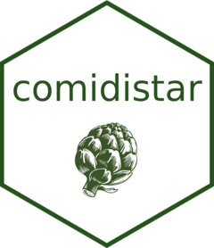

<!-- README.md is generated from README.Rmd. Please edit that file -->

# comidistar 

<!-- badges: start -->

[](https://lifecycle.r-lib.org/articles/stages.html#stable)
[](https://github.com/gongcastro/comidistar/actions)


[](https://codecov.io/gh/gongcastro/comidistar?branch=master)
<!-- badges: end -->

**comidistar** es un paquete de R que contiene una base de datos con las
puntuaciones de las catas a ciegas de [El
Comidista](https://elcomidista.elpais.com/). También contiene algunas
funciones para trabajar con los datos y visualizarlos más fácilmente.
Las puntuaciones y datos adicionales sobre los productos de las catas
fueron transcritos manualmente a partir de los vídeos subidos al canal
de [YouTube](https://www.youtube.com/channel/UCoIJrrwXy_mlr1WkC4vaTnA)
de El Comidista. La documentación del paquete está disponible en este
[link](https://gongcastro.github.io/comidistar/), junto con algunas
viñetas y tutoriales.

## Instalación

Puedes instalar comidistar ejecutando el siguiente código:

``` r
# podrías necesitar instalar el paquete devtools primero
# install.packages("devtools")
devtools::install_github("gongcastro/comidistar")
```

## Ejemplo

Puedes cargar la base de datos como un *data frame* así:

``` r
library(comidistar)
data("puntuaciones")
```

En cada una de estas catas a ciegas de **El Comidista** (disponibles en
su canal de
[YouTube](https://www.youtube.com/channel/UCoIJrrwXy_mlr1WkC4vaTnA)) se
presenta una serie de productos de marcas industriales a una o dos
personas expertas en ese tipo de productos. En los vídeos en los que hay
más de una persona puntuando los productos, el equipo de edición asigna
al producto la media de las puntuaciones. La base de datos
`puntuaciones` muestra las puntuaciones de cada persona del jurado de
forma individual. Ver `?puntuaciones` para más información sobre esta
base de datos.
